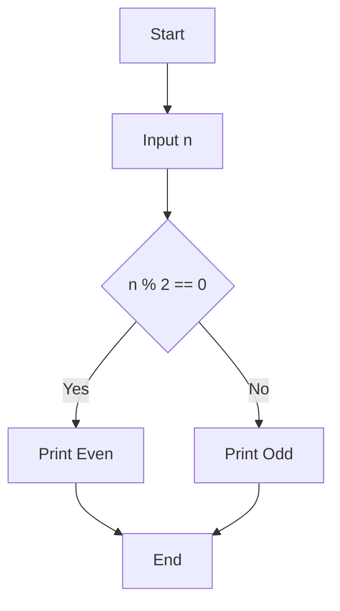
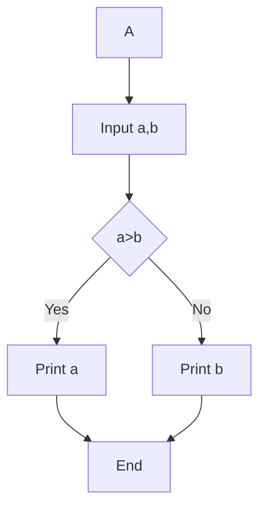
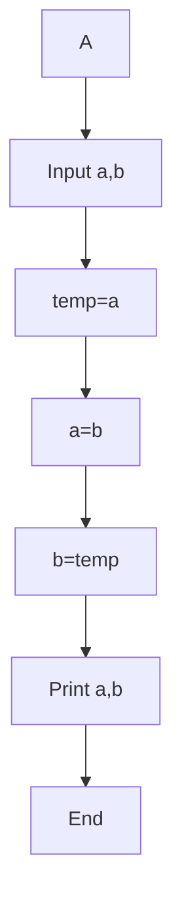

# C Programming Practice 

## 1 Addition of Two Numbers  
**Tag:** Beginner  

### Problem Description  
Write a C program to take two integers as input and print their sum.

### Test Cases

Test Case 1
Input: 5 3
Output: 8

Test Case 2
Input: 10 20
Output: 30

Test Case 3
Input: -5 5
Output: 0

Test Case 4
Input: 100 200
Output: 300  

### Flowchart

```mermaid
flowchart TD
A[Start] --> B[Input a, b]
B --> C[sum = a + b]
C --> D[Print sum]
D --> E[End]
````

<details>

<summary>Click to View Answer</summary>

```c
#include <stdio.h>

int main() {
    int a, b;
    scanf("%d %d", &a, &b);
    printf("%d", a + b);
    return 0;
}
```

</details>

---

## 2 Even or Odd

**Tag:** Beginner

### Problem Description

Take an integer and check whether it is even or odd.

### Test Cases

Input: 4
Output: Even

Input: 7
Output: Odd

Input: 0
Output: Even

Input: -3
Output: Odd

### Flowchart



<details>
<summary>Click to View Answer</summary>

```c
#include <stdio.h>

int main() {
    int n;
    scanf("%d", &n);
    if (n % 2 == 0)
        printf("Even");
    else
        printf("Odd");
    return 0;
}
```

</details>

---

## 3 Simple Interest Calculator

**Tag:** Beginner

### Description

Calculate Simple Interest using formula:
SI = (P * R * T) / 100

### Test Cases

Input: 1000 5 2
Output: 100

Input: 2000 10 1
Output: 200

Input: 5000 2 3
Output: 300

Input: 1500 4 5
Output: 300

### Flowchart

```mermaid
flowchart TD
A --> B[Input P,R,T]
B --> C[SI = (P*R*T)/100]
C --> D[Print SI]
D --> E[End]
```

<details>
<summary>Click to View Answer</summary>

```c
#include <stdio.h>

int main() {
    float p, r, t;
    scanf("%f %f %f", &p, &r, &t);
    printf("%.2f", (p * r * t) / 100);
    return 0;
}
```

</details>

---

## 4 Maximum of Two Numbers

**Tag:** Beginner

### Description

Find the maximum of two numbers using if-else.

### Test Cases

Input: 5 10
Output: 10

Input: 20 3
Output: 20

Input: -5 -1
Output: -1

Input: 7 7
Output: 7

### Flowchart



<details>
<summary>Click to View Answer</summary>

```c
#include <stdio.h>

int main() {
    int a, b;
    scanf("%d %d", &a, &b);
    if (a > b)
        printf("%d", a);
    else
        printf("%d", b);
    return 0;
}
```

</details>

---

## 5 Swap Two Numbers

**Tag:** Beginner

### Description

Swap two numbers using a third variable.

### Test Cases

Input: 5 10
Output: 10 5

Input: 1 2
Output: 2 1

Input: -3 4
Output: 4 -3

Input: 100 200
Output: 200 100

### Flowchart



<details>
<summary>Click to View Answer</summary>

```c
#include <stdio.h>

int main() {
    int a, b, temp;
    scanf("%d %d", &a, &b);
    temp = a;
    a = b;
    b = temp;
    printf("%d %d", a, b);
    return 0;
}
```

</details>