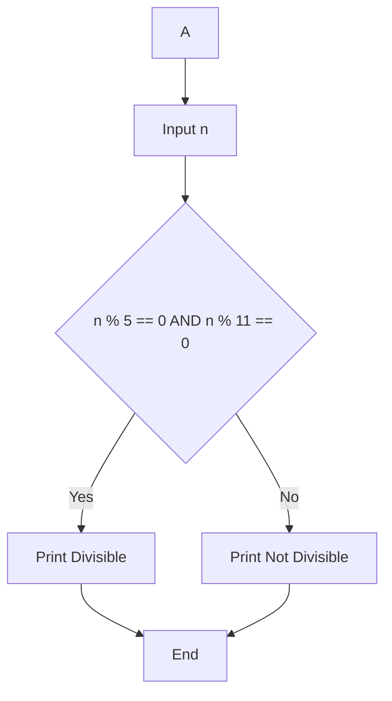
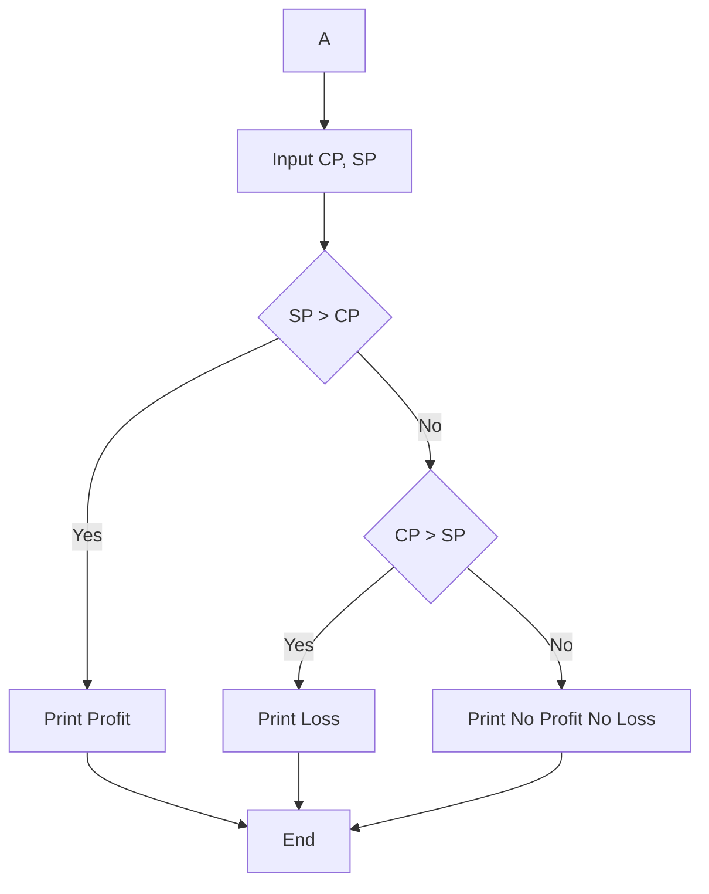
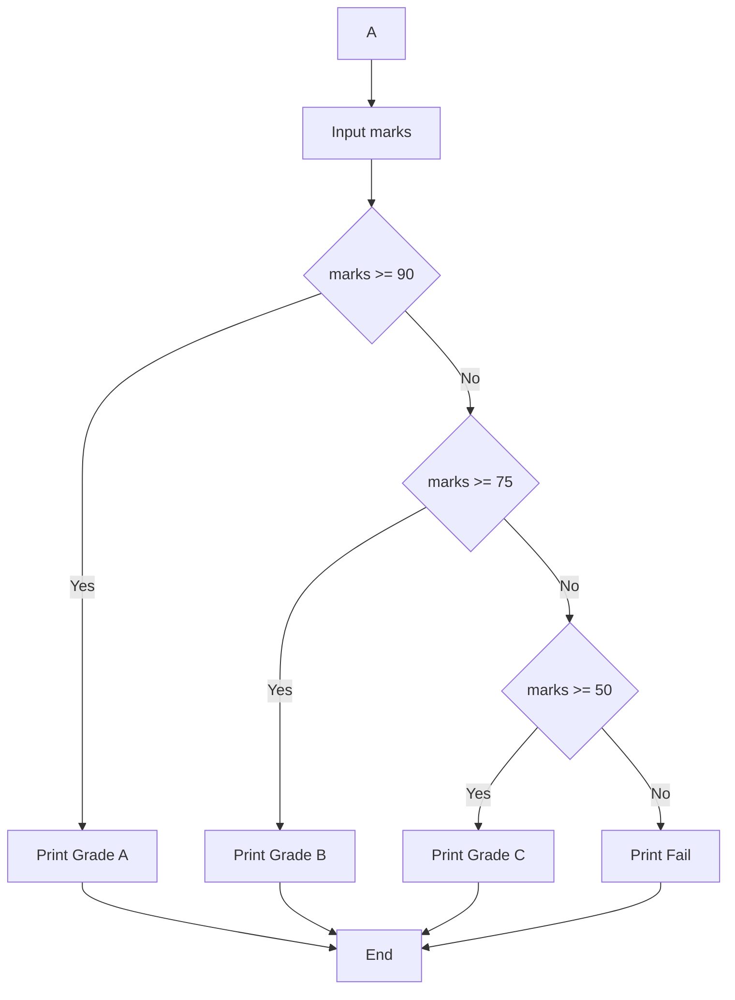
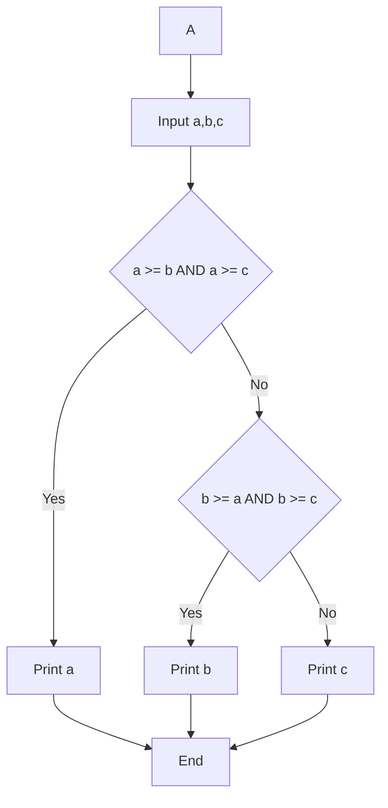

# C Programming Practice

## 1 Positive, Negative or Zero  
**Tag:** Intermediate  

### Problem Description  
Write a C program to check whether a number is positive, negative, or zero.

### Test Cases

Test Case 1  
Input: 10  
Output: Positive  

Test Case 2  
Input: -5  
Output: Negative  

Test Case 3  
Input: 0  
Output: Zero  

Test Case 4  
Input: 100  
Output: Positive  

### Flowchart

```mermaid
flowchart TD
A[Start] --> B[Input n]
B --> C{n > 0}
C -->|Yes| D[Print Positive]
C -->|No| E{n < 0}
E -->|Yes| F[Print Negative]
E -->|No| G[Print Zero]
D --> H[End]
F --> H
G --> H
````

<details>
<summary>Click to View Answer</summary>

```c
#include <stdio.h>

int main() {
    int n;
    scanf("%d", &n);

    if (n > 0)
        printf("Positive");
    else if (n < 0)
        printf("Negative");
    else
        printf("Zero");

    return 0;
}
```

</details>

---

## 2 Divisible by 5 and 11

**Tag:** Intermediate

### Problem Description

Write a C program to check whether a number is divisible by both 5 and 11.

### Test Cases

Test Case 1
Input: 55
Output: Divisible

Test Case 2
Input: 110
Output: Divisible

Test Case 3
Input: 25
Output: Not Divisible

Test Case 4
Input: 121
Output: Not Divisible

### Flowchart



<details>
<summary>Click to View Answer</summary>

```c
#include <stdio.h>

int main() {
    int n;
    scanf("%d", &n);

    if (n % 5 == 0 && n % 11 == 0)
        printf("Divisible");
    else
        printf("Not Divisible");

    return 0;
}
```

</details>

---

## 3 Profit or Loss

**Tag:** Intermediate

### Problem Description

Write a C program to calculate profit or loss.
If selling price > cost price → Profit
If cost price > selling price → Loss
If both equal → No Profit No Loss

### Test Cases

Test Case 1
Input: 100 120
Output: Profit

Test Case 2
Input: 200 150
Output: Loss

Test Case 3
Input: 500 500
Output: No Profit No Loss

Test Case 4
Input: 1000 1300
Output: Profit

### Flowchart



<details>
<summary>Click to View Answer</summary>

```c
#include <stdio.h>

int main() {
    float cp, sp;
    scanf("%f %f", &cp, &sp);

    if (sp > cp)
        printf("Profit");
    else if (cp > sp)
        printf("Loss");
    else
        printf("No Profit No Loss");

    return 0;
}
```

</details>

---

## 4 Grade Calculator

**Tag:** Intermediate

### Problem Description

Write a C program to assign grades based on marks:

* Marks ≥ 90 → Grade A
* Marks ≥ 75 → Grade B
* Marks ≥ 50 → Grade C
* Otherwise → Fail

### Test Cases

Test Case 1
Input: 95
Output: Grade A

Test Case 2
Input: 80
Output: Grade B

Test Case 3
Input: 60
Output: Grade C

Test Case 4
Input: 30
Output: Fail

### Flowchart



<details>
<summary>Click to View Answer</summary>

```c
#include <stdio.h>

int main() {
    int marks;
    scanf("%d", &marks);

    if (marks >= 90)
        printf("Grade A");
    else if (marks >= 75)
        printf("Grade B");
    else if (marks >= 50)
        printf("Grade C");
    else
        printf("Fail");

    return 0;
}
```

</details>

---

## 5 Largest of Three Numbers

**Tag:** Intermediate

### Problem Description

Write a C program to find the largest among three numbers using if-else.

### Test Cases

Test Case 1
Input: 5 10 15
Output: 15

Test Case 2
Input: 20 3 7
Output: 20

Test Case 3
Input: -5 -1 -10
Output: -1

Test Case 4
Input: 100 100 50
Output: 100

### Flowchart



<details>
<summary>Click to View Answer</summary>

```c
#include <stdio.h>

int main() {
    int a, b, c;
    scanf("%d %d %d", &a, &b, &c);

    if (a >= b && a >= c)
        printf("%d", a);
    else if (b >= a && b >= c)
        printf("%d", b);
    else
        printf("%d", c);

    return 0;
}
```

