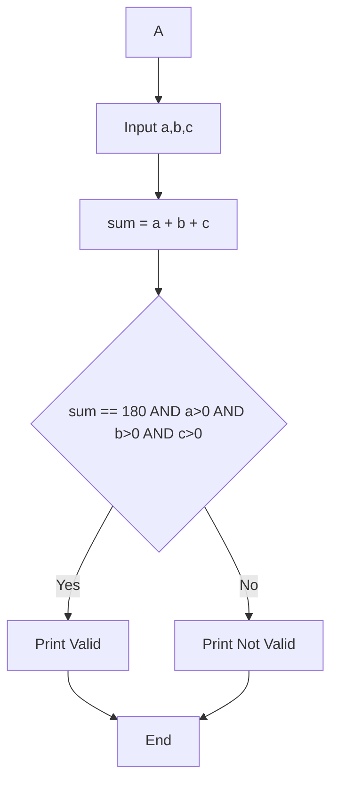
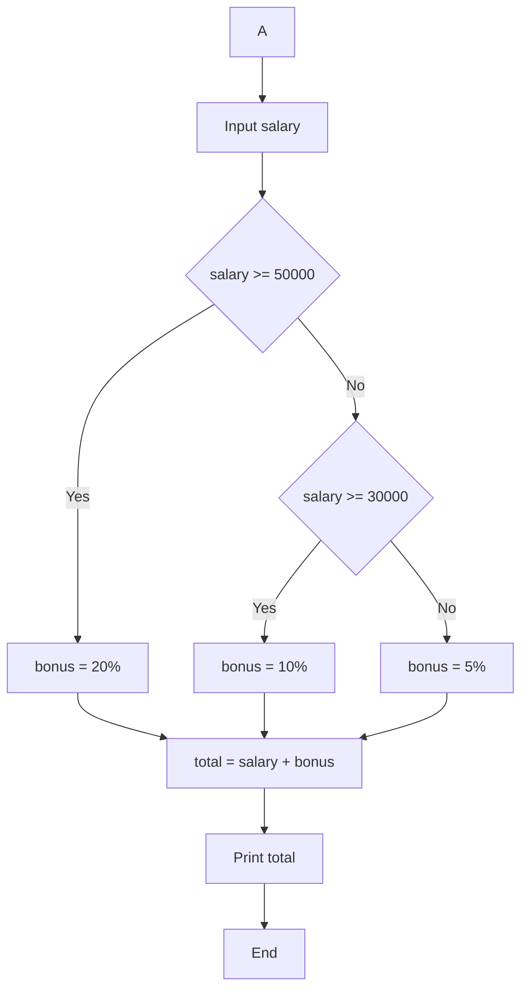

# C Programming Practice 


## 1 Simple Calculator Using if-else  
**Tag:** Advanced  

### Problem Description  
Write a C program that takes two numbers and an operator (+, -, *, /).  
Perform the operation using if-else statements.

### Test Cases

Test Case 1  
Input: 10 5 +  
Output: 15  

Test Case 2  
Input: 20 4 -  
Output: 16  

Test Case 3  
Input: 6 3 *  
Output: 18  

Test Case 4  
Input: 8 2 /  
Output: 4  

### Flowchart

```mermaid
flowchart TD
A[Start] --> B[Input a, b, operator]
B --> C{operator == +}
C -->|Yes| D[result = a + b]
C -->|No| E{operator == -}
E -->|Yes| F[result = a - b]
E -->|No| G{operator == *}
G -->|Yes| H[result = a * b]
G -->|No| I[result = a / b]
D --> J[Print result]
F --> J
H --> J
I --> J
J --> K[End]
````

<details>
<summary>Click to View Answer</summary>

```c
#include <stdio.h>

int main() {
    float a, b;
    char op;
    scanf("%f %f %c", &a, &b, &op);

    if (op == '+')
        printf("%.2f", a + b);
    else if (op == '-')
        printf("%.2f", a - b);
    else if (op == '*')
        printf("%.2f", a * b);
    else if (op == '/')
        printf("%.2f", a / b);
    else
        printf("Invalid Operator");

    return 0;
}
```

</details>

---

## 2 Triangle Validity Check

**Tag:** Advanced

### Problem Description

Write a C program to check whether three angles form a valid triangle.
A triangle is valid if sum of angles = 180.

### Test Cases

Test Case 1
Input: 60 60 60
Output: Valid Triangle

Test Case 2
Input: 90 45 45
Output: Valid Triangle

Test Case 3
Input: 100 50 40
Output: Not Valid

Test Case 4
Input: 0 90 90
Output: Not Valid

### Flowchart



<details>
<summary>Click to View Answer</summary>

```c
#include <stdio.h>

int main() {
    int a, b, c;
    scanf("%d %d %d", &a, &b, &c);

    if (a > 0 && b > 0 && c > 0 && a + b + c == 180)
        printf("Valid Triangle");
    else
        printf("Not Valid");

    return 0;
}
```

</details>

---

## 3 Leap Year Check

**Tag:** Advanced

### Problem Description

Write a C program to check whether a year is a leap year.

A year is leap if:

* Divisible by 4 AND not divisible by 100
  OR
* Divisible by 400

### Test Cases

Test Case 1
Input: 2024
Output: Leap Year

Test Case 2
Input: 1900
Output: Not Leap Year

Test Case 3
Input: 2000
Output: Leap Year

Test Case 4
Input: 2023
Output: Not Leap Year

### Flowchart

```mermaid
flowchart TD
A --> B[Input year]
B --> C{(year%4==0 AND year%100!=0) OR year%400==0}
C -->|Yes| D[Print Leap Year]
C -->|No| E[Print Not Leap Year]
D --> F[End]
E --> F
```

<details>
<summary>Click to View Answer</summary>

```c
#include <stdio.h>

int main() {
    int year;
    scanf("%d", &year);

    if ((year % 4 == 0 && year % 100 != 0) || year % 400 == 0)
        printf("Leap Year");
    else
        printf("Not Leap Year");

    return 0;
}
```

</details>

---

## 4 Electricity Bill Calculator

**Tag:** Advanced

### Problem Description

Calculate electricity bill based on units consumed:

* First 100 units → ₹5 per unit
* Next 100 units → ₹7 per unit
* Above 200 units → ₹10 per unit

### Test Cases

Test Case 1
Input: 50
Output: 250

Test Case 2
Input: 150
Output: 850

Test Case 3
Input: 250
Output: 1850

Test Case 4
Input: 100
Output: 500

### Flowchart

```mermaid
flowchart TD
A --> B[Input units]
B --> C{units <= 100}
C -->|Yes| D[bill = units * 5]
C -->|No| E{units <= 200}
E -->|Yes| F[bill = 100*5 + (units-100)*7]
E -->|No| G[bill = 100*5 + 100*7 + (units-200)*10]
D --> H[Print bill]
F --> H
G --> H
H --> I[End]
```

<details>
<summary>Click to View Answer</summary>

```c
#include <stdio.h>

int main() {
    int units;
    float bill;
    scanf("%d", &units);

    if (units <= 100)
        bill = units * 5;
    else if (units <= 200)
        bill = 100 * 5 + (units - 100) * 7;
    else
        bill = 100 * 5 + 100 * 7 + (units - 200) * 10;

    printf("%.2f", bill);

    return 0;
}
```

</details>

---

## 5 Salary Bonus Calculator

**Tag:** Advanced

### Problem Description

Calculate bonus based on salary:

* Salary ≥ 50000 → 20% bonus
* Salary ≥ 30000 → 10% bonus
* Otherwise → 5% bonus

Print total salary after adding bonus.

### Test Cases

Test Case 1
Input: 60000
Output: 72000

Test Case 2
Input: 40000
Output: 44000

Test Case 3
Input: 20000
Output: 21000

Test Case 4
Input: 50000
Output: 60000

### Flowchart



<details>
<summary>Click to View Answer</summary>

```c
#include <stdio.h>

int main() {
    float salary, bonus, total;
    scanf("%f", &salary);

    if (salary >= 50000)
        bonus = salary * 0.20;
    else if (salary >= 30000)
        bonus = salary * 0.10;
    else
        bonus = salary * 0.05;

    total = salary + bonus;

    printf("%.2f", total);

    return 0;
}
```

</details>

